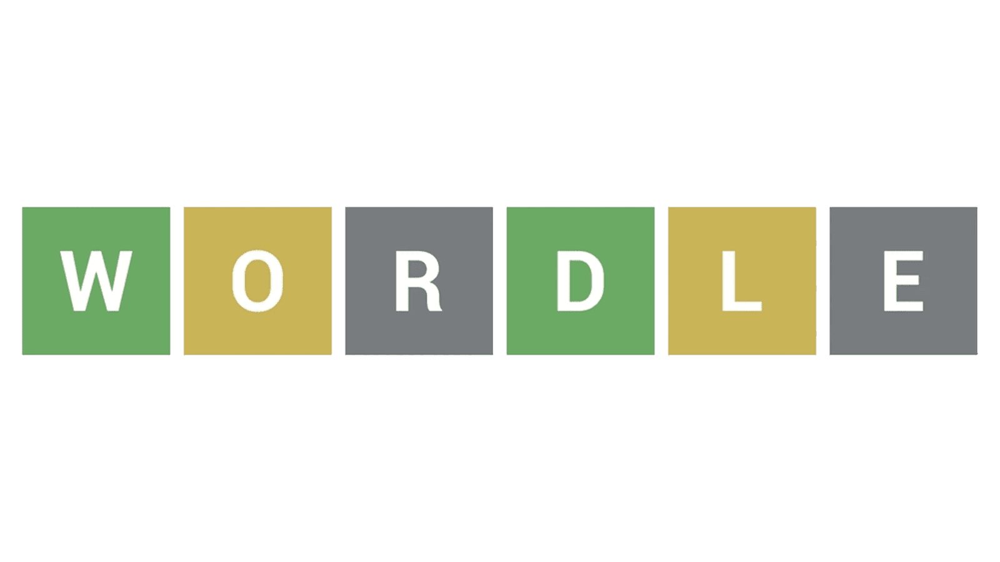

# In-Browser Wordle App
 

## About:
A fun word game where in order to win, the user must guess the secret 5-letter word by guessing words, and using hints they get from each word they try. Can *you* guess the word?

## Getting started:
You can play the game by clicking [this link](https://zacharywj.github.io/wordle-app/), right now! Just load the game in your browser to get started. The instructions for how to play are listed below, as well as in a drop down menu in the top left of the game's browser.

## How to play:
+ Load the game in browser. Wordle automatically selects a 5-letter word from it's word bank for you to guess! You have 6 guesses. Start by typing in a 5-letter word of your choice. The game then evaluates your guess and tells you if you got any of the letters right!

+ For each of the letters in your guess that are **NOT** in the secret word, their box is colored gray. 

+ If a letter of your guess is in the word, but not in the right position, it is colored **pink.**

+ If the letter is in the word AND in the right position within the secret word, it's colored **cyan.**

+ Use the clues given from each of your guesses, and their letters, to try and come up with the secret word by your 6th, *final* guess.

+ If you guess the secret word, you win!

+ If you do not, and you've used all 6 of your guesses, the game is over and you lose. The game will then tell you what the correct answer was. 

## Technologies Used:
To write my application I utilized these languages and associated libraries, API's and/or CDNs.
+ HTML
+ CSS
+ JavaScript 
    + JQuery
    + Toastr
    + Animate.css

## Attributions:
Libraries and assets I used besides base coding languages for my application. 
+ Toastr
+ Animate.css
+ JQuery

## Future updates, coming soon:
+ An expanded word bank.
+ Various sound effects triggered as input is typed, guesses are submitted, individual letters evaluated (different for when flipped to gray, pink or cyan) as well as when the game is won or lost.
+ An on-going experience with a points system, allowing the player to buy and use hints as they play consecutive rounds without losing.   
